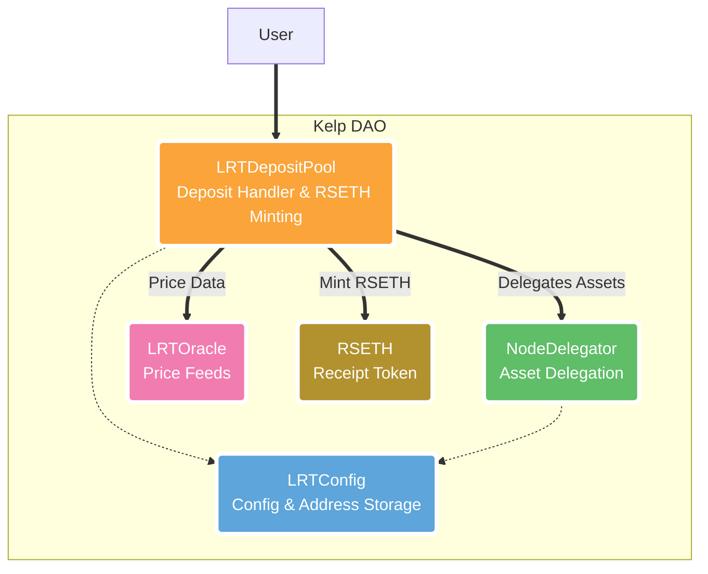

Kelp aims to provide liquidity rewards for staked ETH assets by integrating with the EigenLayer protocol. It consists of core contracts for configuration, deposits, delegating to strategies, pricing, and receipt tokens. 

I reviewed the contracts through manual analysis, focused on security, intended behavior, and integration.

[LRTConfig](https://github.com/code-423n4/2023-11-kelp/blob/main/src/LRTConfig.sol): An upgradeable contract which is responsible for storing the configuration of the Kelp product. It is also responsible for storing the addresses of the other contracts in the Kelp product.

[LRTDepositPool](https://github.com/code-423n4/2023-11-kelp/blob/main/src/LRTDepositPool.sol): An upgradeable contract which receives the funds deposited by users into the Kelp product. From here, the funds are transferred to [NodeDelegator](https://github.com/code-423n4/2023-11-kelp/blob/main/src/NodeDelegator.sol)s contracts.

NodeDelegator: These are contracts that receive funds from the LRDepositPool and delegate them to the EigenLayer strategy. The funds are then used to provide liquidity on the EigenLayer protocol. It is also an upgradeable contract.

[LRTOracle](https://github.com/code-423n4/2023-11-kelp/blob/main/src/LRTOracle.sol): An upgradeable contract which is responsible for fetching the price of Liquid Stasking Tokens tokens from oracle services.

[RSETH](https://github.com/code-423n4/2023-11-kelp/blob/main/src/RSETH.sol): Receipt token for depositing into the Kelp product. It is an upgradeable ERC20 token contract.

**Scope**

| Contract              | Purpose                                                        | SLOC | Libraries Used            |
|-----------------------|----------------------------------------------------------------|------|----------------------------|
| [LRTConfig](https://github.com/code-423n4/2023-11-kelp/blob/main/src/LRTConfig.sol)             | Configuration contract                                        | 111  |                            |
| [LRTDepositPool](https://github.com/code-423n4/2023-11-kelp/blob/main/src/LRTDepositPool.sol)        | User interfacing contract when funds are deposited            | 97   |                            |
| [NodeDelegator](https://github.com/code-423n4/2023-11-kelp/blob/main/src/NodeDelegator.sol)         | Recipient of funds from LRTDepositPool. Sends funds to Eigenlayer strategies | 65   |                            |
| [LRTOracle](https://github.com/code-423n4/2023-11-kelp/blob/main/src/LRTOracle.sol)             | Gets prices of liquid staking tokens                          | 60   | ChainlinkPriceOracle       |
| [RSETH](https://github.com/code-423n4/2023-11-kelp/blob/main/src/RSETH.sol)                 | Receipt token user receives upon depositing in LRTDepositPool | 45   |                            |
| [ChainlinkPriceOracle](https://github.com/code-423n4/2023-11-kelp/blob/main/src/oracles/ChainlinkPriceOracle.sol)  | Wrapper contract to integrate Chainlink oracles in LRTOracle   | 25   |                            |
| [LRTConfigRoleChecker](https://github.com/code-423n4/2023-11-kelp/blob/main/src/utils/LRTConfigRoleChecker.sol)  | Handles role checks                                            | 33   |                            |
| [UtilLib](https://github.com/code-423n4/2023-11-kelp/blob/main/src/utils/UtilLib.sol)               | Helper function library                                       | 7    |                            |
| [LRTConstants](https://github.com/code-423n4/2023-11-kelp/blob/main/src/utils/LRTConstants.sol)          | Shared constant variables                                      | 10   |                            |

Note: The "Libraries Used" column indicates any external libraries or contracts that are utilized by the respective contract.

# Approach

My review involved:

- Manual code analysis of logic and control flow
- Checking input validation and exit conditions 
- Identifying trust relationships between contracts
- Assessing access control and privilege escalation risks
- Evaluating protocol integration points and failure modes
- Considering economic incentives and tokenomics 

# Architecture 

Kelp has a modular architecture with well-defined contract responsibilities:

- **LRTConfig:** Stores addresses and parameters 
- **LRTDepositPool:** Frontend for user deposits
- **NodeDelegator:** Delegates assets to EigenLayer 
- **LRTOracle:** Provides asset price feeds
- **RSETH:** Receipt token for deposits

**Diagram of the Kelp architecture showing the key contracts and their interactions:**



**Key Points**

- LRTConfig stores addresses and parameters for other contracts
- LRTDepositPool is the frontend for user deposits 
- It mints RSETH tokens in sync with deposits
- NodeDelegator receives assets from LRTDepositPool and delegates to strategies
- LRTOracle provides pricing data to the system
- Modular architecture allows flexibility and separation of concerns

The core dependency is the unified configuration in LRTConfig, which must be secure and authorize only valid contract addresses.

**LRTConfig**

The LRTConfig contract is relied upon by other contracts for address lookups via the [`getContract`](https://github.com/code-423n4/2023-11-kelp/blob/f751d7594051c0766c7ecd1e68daeb0661e43ee3/src/LRTConfig.sol#L131-L133) and `getToken` functions:

```solidity
    function getContract(bytes32 contractKey) external view override returns (address) {
        return contractMap[contractKey];
    }
```
```js
// Example usage in LRTDepositPool
address lrtOracle = LRTConfig.getContract(LRT_ORACLE);
```
If an incorrect address is returned, it could lead to interactions with unauthorized contracts.

The key risk identified is that `setContract` allows the admin to update any address mapping. Proper access control is needed to restrict this.

**LRTOracle** 

The LRTOracle provides pricing data that is consumed by other contracts: [getAssetPrice](https://github.com/code-423n4/2023-11-kelp/blob/f751d7594051c0766c7ecd1e68daeb0661e43ee3/src/LRTOracle.sol#L45-L47)

```solidity
    function getAssetPrice(address asset) public view onlySupportedAsset(asset) returns (uint256) {
        return IPriceFetcher(assetPriceOracle[asset]).getAssetPrice(asset);
    }
```

An vulnerability in `getAssetPrice` or `getRSETHPrice` could allow manipulated rates.

The main risk is that the LRTManager can set the price oracles, opening up privilege escalation.

**RSETH**

The RSETH contract must mint tokens in sync with LRTDepositPool based on exchange rates. 

A mismatch in logic between the two could lead to economic exploits:

The key risk is there is no supply cap or validation in `mint`, so it must be used correctly.

This separation of concerns follows best practices. The use of upgradeable proxy contracts also allows flexibility. 

Some dependencies to note:

- LRTConfig is relied on for address lookups
- LRTOracle provides critical pricing information
- RSETH must mint tokens correctly in sync with LRTDepositPool

# Findings

## Centralization Risks

- The LRTManager role has broad privileges such as pausing transfers and setting oracles. This could lead to centralized control over the system.

- The lrETH token address is set once at initialization but the admin can later change it. This poses a risk as the token is relied on for minting.

**LRTManager Privileges**

The LRTManager role has broad authority in several contracts:

```solidity
    function pause() external onlyLRTManager {
        _pause();
    }
}

// LRTOracle
[updatePriceOracleFor](https://github.com/code-423n4/2023-11-kelp/blob/f751d7594051c0766c7ecd1e68daeb0661e43ee3/src/LRTOracle.sol#L88-L99)

```solidity
    function updatePriceOracleFor(
        address asset,
        address priceOracle
    )
        external
        onlyLRTManager
        onlySupportedAsset(asset)
    {
        UtilLib.checkNonZeroAddress(priceOracle);
        assetPriceOracle[asset] = priceOracle;
        emit AssetPriceOracleUpdate(asset, priceOracle);
    }
```

This allows an LRTManager to pause transfers and change price oracles. If a single account held this role, they could control deposits and pricing.

The main functions the role should not have are pausing, setting oracles, and updating config addresses.

**rsETH Update**

The rsETH token address is set at initialization in LRTConfig: [Line 21](https://github.com/code-423n4/2023-11-kelp/blob/f751d7594051c0766c7ecd1e68daeb0661e43ee3/src/LRTConfig.sol#L21)

https://github.com/code-423n4/2023-11-kelp/blob/f751d7594051c0766c7ecd1e68daeb0661e43ee3/src/LRTConfig.sol#L41-L68

```solidity
// LRTConfig
address public rsETH;

function initialize(address rsETH_) {
  rsETH = rsETH_; 
}
```

But the admin can later change this: [setRsETH](https://github.com/code-423n4/2023-11-kelp/blob/f751d7594051c0766c7ecd1e68daeb0661e43ee3/src/LRTConfig.sol#L144-L147)

```solidity 
    function setRSETH(address rsETH_) external onlyRole(DEFAULT_ADMIN_ROLE) {
        UtilLib.checkNonZeroAddress(rsETH_);
        rsETH = rsETH_;
    }
```

This poses a risk as rsETH is relied on for minting in LRTDepositPool. An unauthorized contract could lead to loss of funds.

Making rsETH immutable after initialization would prevent this centralized control over minting.

## Tokenomics

- RSETH minting is proportional to the amount deposited. No supply cap is enforced. This could incentivize depositing incorrectly priced assets to mint excess RSETH.

The key minting logic is in [_mintRsETH](https://github.com/code-423n4/2023-11-kelp/blob/f751d7594051c0766c7ecd1e68daeb0661e43ee3/src/LRTDepositPool.sol#L151-L157) in LRTDepositPool:

```solidity
    function _mintRsETH(address _asset, uint256 _amount) private returns (uint256 rsethAmountToMint) {
        (rsethAmountToMint) = getRsETHAmountToMint(_asset, _amount);


        address rsethToken = lrtConfig.rsETH();
        // mint rseth for user
        IRSETH(rsethToken).mint(msg.sender, rsethAmountToMint);
    }
```

It calculates the rsethAmount based on the deposit amount, gets the RSETH token address, and mints the tokens.

The issue is there is no logic enforcing a max cap on the total RSETH supply: [mint](https://github.com/code-423n4/2023-11-kelp/blob/f751d7594051c0766c7ecd1e68daeb0661e43ee3/src/RSETH.sol#L47-L49)

```solidity
    function mint(address to, uint256 amount) external onlyRole(MINTER_ROLE) whenNotPaused {
        _mint(to, amount);
    }
}

// No check on max supply
```

This means that if incorrect exchange rates are provided, an attacker could deposit at that rate and mint arbitrarily large amounts of RSETH.

For example:

1. Attacker sets a high rate for some asset in LRTOracle

2. Attacker deposits a small amount of that asset

3. `_mintRsETH` uses the high rate to mint a large amount of RSETH  

Adding a max supply cap on RSETH would prevent this kind of exploit.

## Logic Issues

- No validation of RSETH minting contract in LRTDepositPool (_mintRsETH). An unauthorized contract could be set via LRTConfig.

- Exchange rate in LRTOracle (getRSETHPrice) only considers LRTDepositPool balance. It does not account for assets already delegated through NodeDelegators. The total deposits could be inflated, affecting the rate.

**No RSETH Validation in _mintRsETH**

The [`_mintRsETH`](https://github.com/code-423n4/2023-11-kelp/blob/f751d7594051c0766c7ecd1e68daeb0661e43ee3/src/LRTDepositPool.sol#L151-L157) function gets the RSETH token address from LRTConfig but does not validate it:

```solidity
    function _mintRsETH(address _asset, uint256 _amount) private returns (uint256 rsethAmountToMint) {
        (rsethAmountToMint) = getRsETHAmountToMint(_asset, _amount);


        address rsethToken = lrtConfig.rsETH();
        // mint rseth for user
        IRSETH(rsethToken).mint(msg.sender, rsethAmountToMint);
    }
```

This could allow an unauthorized contract to be set as the rsETH address and manipulate minting.

For example: 

```solidity
// Attacker contract
function mint(address to, uint amount) external {
  msg.sender.transfer(amount); // drain funds
}
```

The admin could point LRTConfig.rsETH to this contract. `_mintRsETH` would then drain funds instead of minting tokens.

This can be mitigated by:

- Checking rsETH address against a hardcoded verified address
- Using ERC165 to validate rsETH supports minting

**Inflated Rates in getRSETHPrice**

The `getRSETHPrice` function sums all deposits via LRTDepositPool only: [getRSETHPrice](https://github.com/code-423n4/2023-11-kelp/blob/f751d7594051c0766c7ecd1e68daeb0661e43ee3/src/LRTOracle.sol#L52-L76)

```solidity
    function getRSETHPrice() external view returns (uint256 rsETHPrice) {
        address rsETHTokenAddress = lrtConfig.rsETH();
        uint256 rsEthSupply = IRSETH(rsETHTokenAddress).totalSupply();


        if (rsEthSupply == 0) {
            return 1 ether;
        }


        uint256 totalETHInPool;
        address lrtDepositPoolAddr = lrtConfig.getContract(LRTConstants.LRT_DEPOSIT_POOL);


        address[] memory supportedAssets = lrtConfig.getSupportedAssetList();
        uint256 supportedAssetCount = supportedAssets.length;


        for (uint16 asset_idx; asset_idx < supportedAssetCount;) {
            address asset = supportedAssets[asset_idx];
            uint256 assetER = getAssetPrice(asset);


            uint256 totalAssetAmt = ILRTDepositPool(lrtDepositPoolAddr).getTotalAssetDeposits(asset);
            totalETHInPool += totalAssetAmt * assetER;


            unchecked {
                ++asset_idx;
            }
        }
```

But it misses deposits already delegated through NodeDelegators, inflating the rate.

This can be fixed by tracking an independent `totalSystemDeposits` variable that sums across all contracts.

# Recommendations

- Reduce LRTManager privileges to only critical operations like emergency shutdown. Move oracle control to admin only.

- Make rsETH immutable in LRTConfig after initialization.

- Enforce a cap on RSETH total supply in minting logic.

- In _mintRsETH, verify rsETH contract address using a hardcoded known good address.

- Maintain a separate total deposits variable in LRTOracle that tracks funds across all contracts.

Overall the system architecture is well designed but some key risks around privilege, logic, and incentives exist. Adding validation, immutable configuration, and supply caps would make the system more robust.

### Time spent:
28 hours